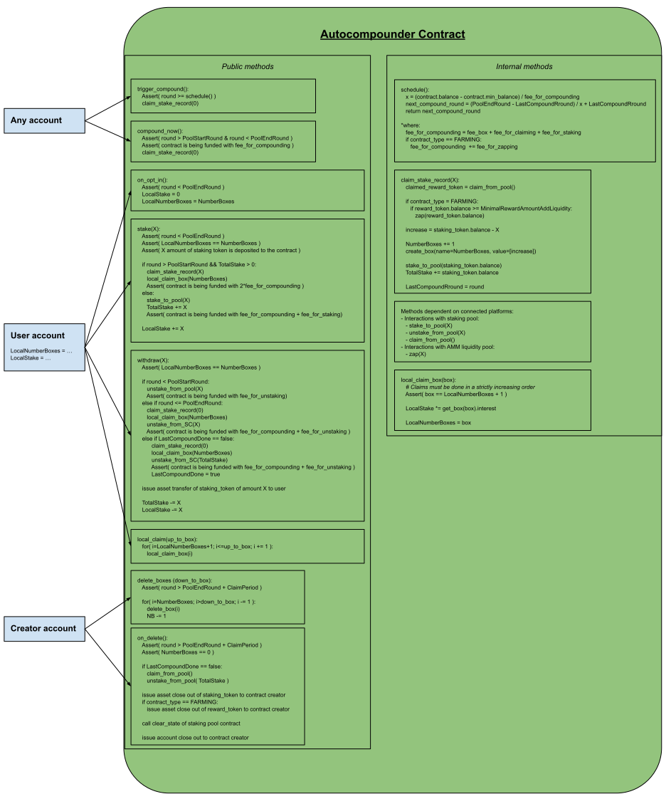
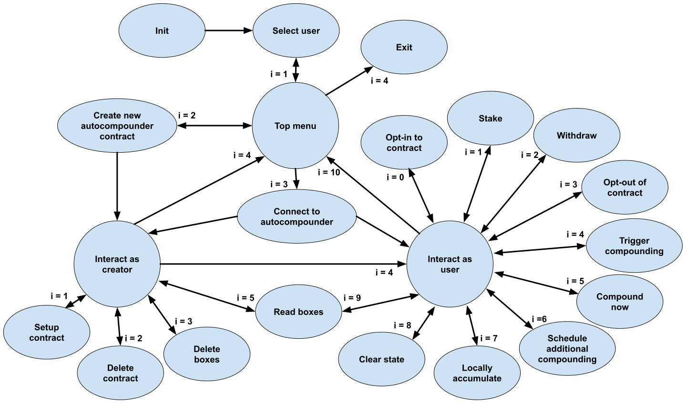

# Staking Pools Autocompounder

A popular way for cryptocurrency investors to earn yield on their holdings is to deposit them in 
[staking pools](https://coinmarketcap.com/alexandria/glossary/staking-pool).
The yield can be maximized by reinvesting the earnings, i.e. by 
[compound interest](https://en.wikipedia.org/wiki/Compound_interest).
Traditionally, the users need to manually compound the rewards, which is time- and cost-consuming.
This project provides a modular framework solution for how the interest can be automatically compounded for staking 
pools on Algorand network through the use of smart contracts.
Specifically, it demonstrates the autocompounding ability for distribution pools (i.e. pools where the users are 
rewarded for staking an asset with the rewards paid in the same asset) and liquidity farming pools (i.e. pools where the
users stake a token representing a portion of liquidity in an AMM liquidity pool and are rewarded with a different
token).
The currently written smart contracts support staking pools of [Cometa](https://cometa.farm/) with integration of 
[Tinyman](https://tinyman.org/) V2 for the liquidity farming pools.

# Smart Contract Architecture and Functionality

There are two variations of the autocompounding smart contract - one for autocompounding of 
[distribution pools](src/CompoundContract.py) and another one for 
[liquidity farming pools](src/FarmCompoundContract.py).
Both variations have the same basic structure to provide the functionality described in more detail further on.
The structure is schematically depicted in the simplified figure below.

The autocompounder operates by users depositing the staking assets to it, which then forwards them to the staking pool.
This enables the contract to jointly operate with (i.e. compound) all users' funds (which are jointly tracked in global 
state `TS`).
The contract keeps track of each user's contribution to that amount in local state `LS`.
When users deposit the staking assets to the contract, they also have to provide an ALGO deposit to cover the fees for 
at least one compounding of the stake.
The action of compounding the stake consists of claiming the rewards from the staking pool and reinvesting them back to 
it.
During that action, the interest earned since the last compounding of the stake gets recorded in a sequentially numbered 
box (which is later used to update individual's stake).
The fees associated with these actions (i.e. transaction fees and increase in the minimal balance requirements) are 
covered by the funds that were deposited by the users at the time of staking.
This allows anyone to trigger the compounding actions (without having to cover the fees).
The compounding action can be triggered this way only according to a defined schedule.

The schedule can be configured as an arbitrary function of current time (i.e. network round), times of previous 
compounding actions, and the available funds to cover future compounding actions.
In the current implementation, the schedule simply defines the time of the next compounding by dividing the time between
the last compounding action `LCR` and the time of pool ending `PER` in equal slots, depending on the amount of available
funds.
Since new users can join at any time (meaning they deposit also additional funds for covering the compounding fees), it 
means that the schedule is dynamically adjusted to maximize the yield.
Besides the scheduled compounding actions, it is also possible to trigger instantly a compounding of the stake (which 
operates the same way, just requires depositing additional funds to cover the fees).

To keep track of which users have contributed how much between two compounding actions, it is tracked for each user up 
to which box `LNB` has one "locally claimed" the interest that is recorded in it.
Note that a user cannot claim a box that was created prior to one's joining the pool.
This mechanism with box tracking allows that users can arbitrarily add to their stake or withdraw it (partially or in 
full) at any point in time.
The only prerequisite is that before adding to the stake or withdrawing, the user claims all the boxes up to the most 
recent one `NB`.
If the staking or withdrawal is done during the time the pool is live, the stake gets first compounded (for which the 
user has to supply additional funds to cover the fees).
Note that boxes can be "locally claimed" in batches, fees for which amounts to much less compared to the case where a 
user would be individually compounding the stake.

When the staking pool ends, the users should withdraw their funds from the autocompound contract in the claiming period
`CP`.
After the claiming period ends or all users have withdrawn their compounded stakes, the creator of the autocompound 
contract is allowed to delete the boxes and the contract.
This gives the creator the fees that were used for the creation of the boxes and any remaining staking tokens due to 
rounding errors.
This mechanism gives the contract creator an incentive to gather as many users, which would also profit them from the  
more frequent compounding actions.

The only difference between the autocompound contract for [distribution pools](src/CompoundContract.py) and 
[liquidity farming pools](src/FarmCompoundContract.py) is that in the latter case, the reward token is first
single-sidedly added to the AMM liquidity pool (i.e. zapped) before the farming token is reinvested.
Since it might not be economically efficient (or technically feasible due to limited precision) to zap very small 
amounts, there is an option to set the lower limit of rewards that are zapped (`MRAAL`).
If compounding does not zap the rewards, they get accumulated and zapped on next compounding if the limit is reached.
Similarly, autocompounding of other types of staking pools can easily be integrated by simply changing the steps taken 
after claiming of the rewards (i.e. by modifying the `claim_stake_record` internal method).
Moreover, integration of different staking pool solutions is straightforward by adapting the `stake_to_pool`, 
`unstake_from_pool` and `claim_from_pool` internal methods to fit the particular pool requirements.

# Demo Interactions

The project includes a [script](interactions_state_machine.py) for a sample interaction with autocompounding smart 
contracts through a simple command-line interface.
The script implements the state machine shown in figure below.

An example scenario of interactions with the platform through the provided interaction 
[script](interactions_state_machine.py) has been recorded and the
[video excerpts](demo/README.md) documented.

To test the platform with the provided [script](interactions_state_machine.py), the following is required:
- Python (>=3.10) with libraries in [requirements.txt](requirements.txt), 
which can be installed using `pip install -r requirements.txt`
- One or more mnemonics stored in plain text in .txt files (with spaces as delimiters)
*<= This is for simplicity of testing only!*
- Connection to Algorand Testnet (e.g. via [Sandbox](https://github.com/algorand/sandbox) or 
publicly available nodes by [AlgoExplorer](https://algoexplorer.io/) 
https://node.testnet.algoexplorerapi.io)
- Test ALGO and e.g. test USDC, which can both be received at https://dispenser.testnet.aws.algodev.network/

For testing, clone the repository and run the provided [script](interactions_state_machine.py).

# Roadmap

1) **Box management optimizations**: Currently, a box recording the compound interest at the time of interaction is 
created even when the earned interest is 0 due to the limited calculation precision. Such boxes could be omitted, 
freeing funds for creation of additional boxes, i.e. possibility of more compounding instances.

2) **Smart contract optimization**: Improve code re-usage and modularity.

3) **Integration of other staking platforms and AMMs on Algorand network**: e.g. [Humble](https://www.humble.sh/), 
[Algofi](https://www.algofi.org/) and [Pact](https://www.pact.fi/).

4) **Implementation of different schedule strategies**: Staking pools commonly give higher returns at their starts since
there are fewer users participating. In such a case, it would be beneficial to compound more frequently at the start of 
the pool. This simply requires the exchange of the schedule module in the contract.

5) **Different ALGO reward integration**: Staking pools support distribution of ALGO in addition to the rewards paid 
in an ASA. In the current smart contract version, the ALGO rewards are used for enabling additional compounding instead of 
being distributed to the users.

6) **Dynamic transaction fees**: Currently, transaction fees are hardcoded to meet the minimum network requirement. In 
case of a persistent network congestion, autocompounding could not be triggered.
 
7) **Simplify autocompound contract setup**: More parameters of autocompound contract could be fetched from connected 
staking and swap contracts instead of being manually entered. Currently, this is due to the limited documentation of 
connected contracts.

8) **User-friendly interface**: for a seamless user experience and secure interactions (i.e. multiple wallet 
integrations).

   

# Notice

The project was developed during [Algorand Greenhouse Hack #3](https://gitcoin.co/hackathon/greenhouse3/onboard) 
and submitted to [Yield Autocompounder](https://gitcoin.co/issue/29660) category.

The smart contracts are written in [PyTEAL](https://github.com/algorand/pyteal) and 
are [ABI compliant](https://developer.algorand.org/docs/get-details/dapps/smart-contracts/ABI/).
The command-line interface is written in Python and uses the 
[py-algorand-sdk](https://github.com/algorand/py-algorand-sdk).

The software is not meant for production deployment - the smart contracts have not been audited and the provided 
test user interface does not follow the recommended security guidelines regarding handling of mnemonics.

Author: Uroš Hudomalj - https://github.com/uhudo
